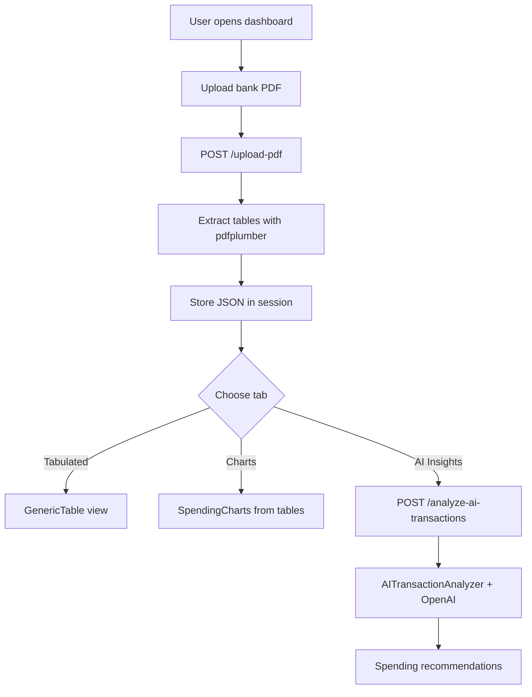
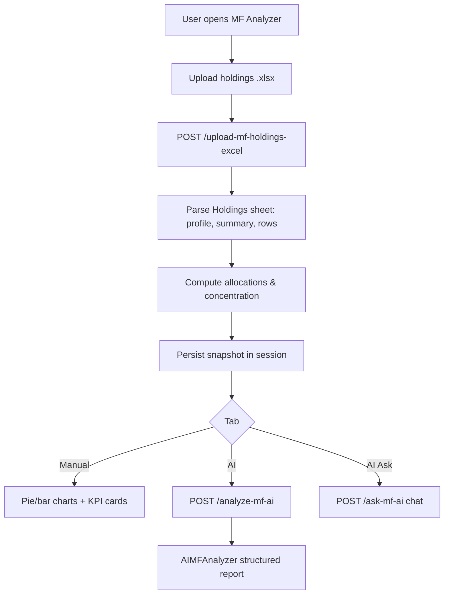
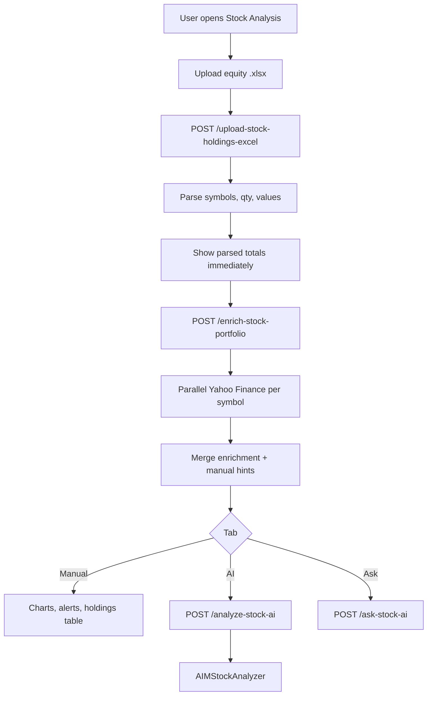
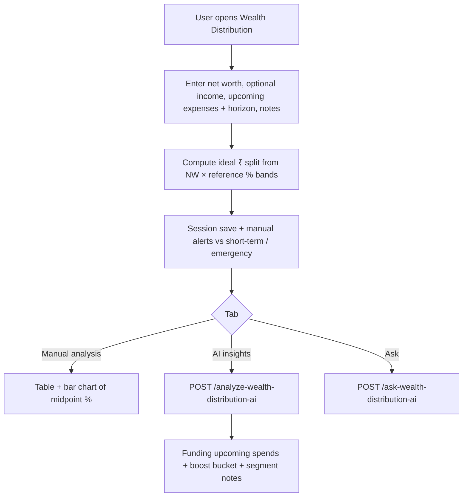
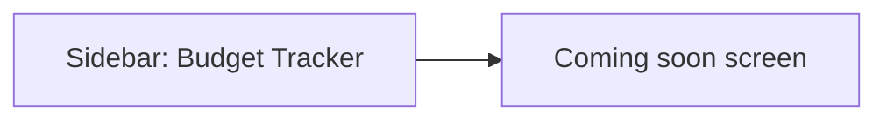
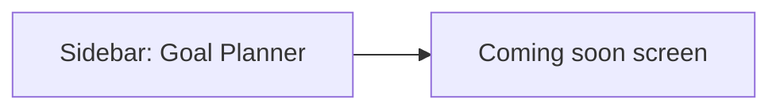
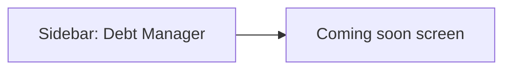
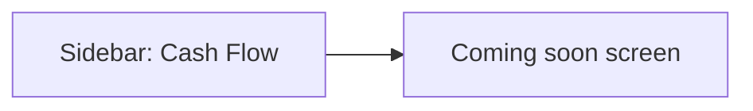
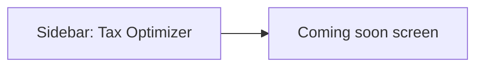
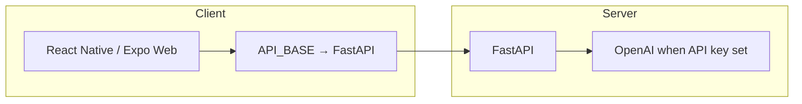

# Dashboard flowcharts

High-level user and data flows for **Personal Wealth Analyzer** dashboards. Diagrams use [Mermaid](https://mermaid.js.org/) (render in GitHub, VS Code with a Mermaid extension, or export to SVG/PNG).

---

## Account Statement Analyzer

---

## MF Analyzer

---

## Stock Market Analysis

---

## Wealth Distribution

---

## Budget Tracker (placeholder)

---

## Goal Planner (placeholder)

---

## Debt Manager (placeholder)

---

## Cash Flow (placeholder)

---

## Tax Optimizer (placeholder)

---

## Shared client stack

