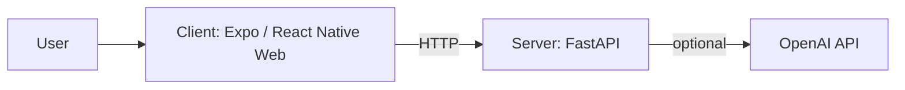
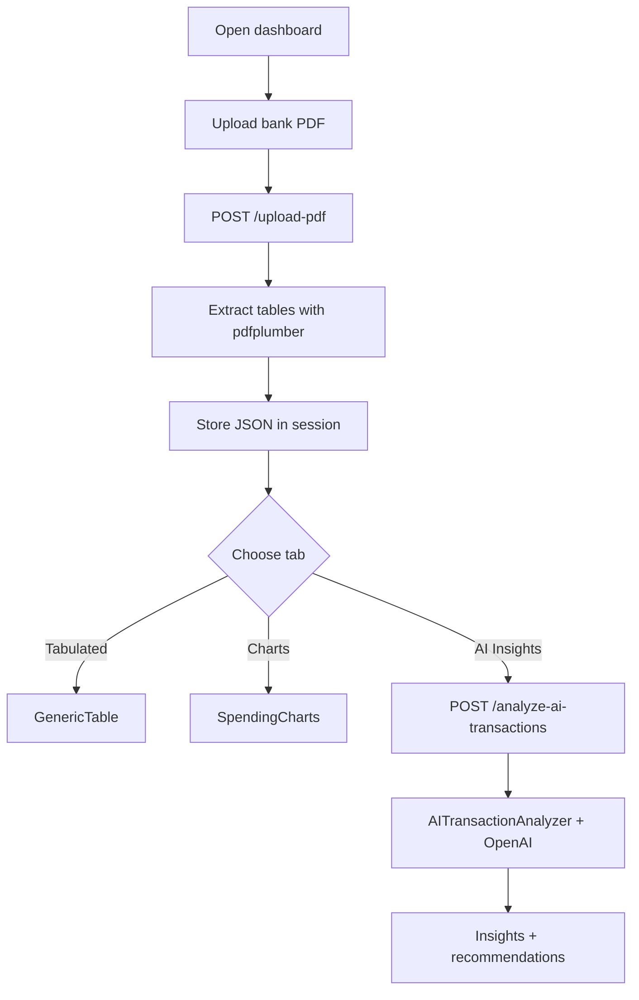
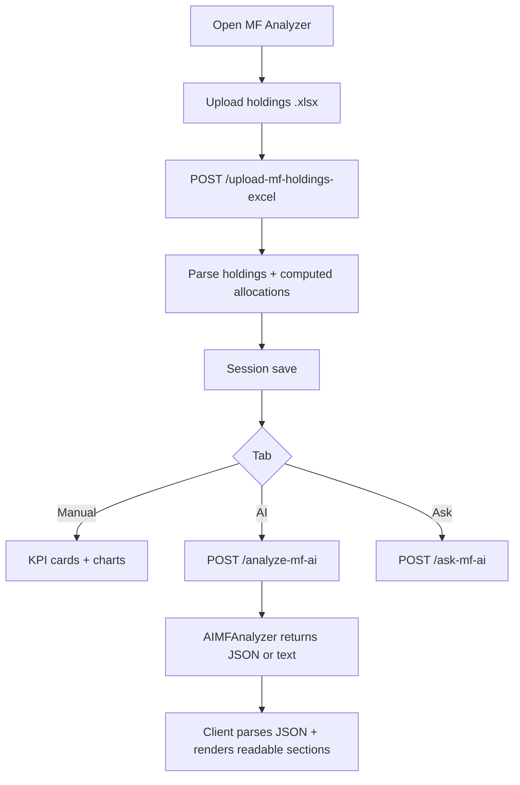
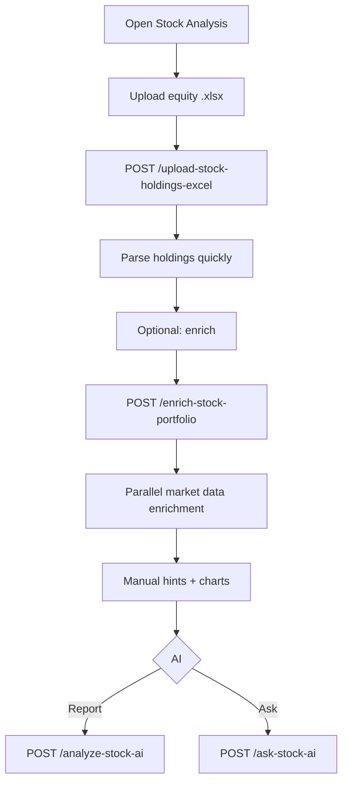
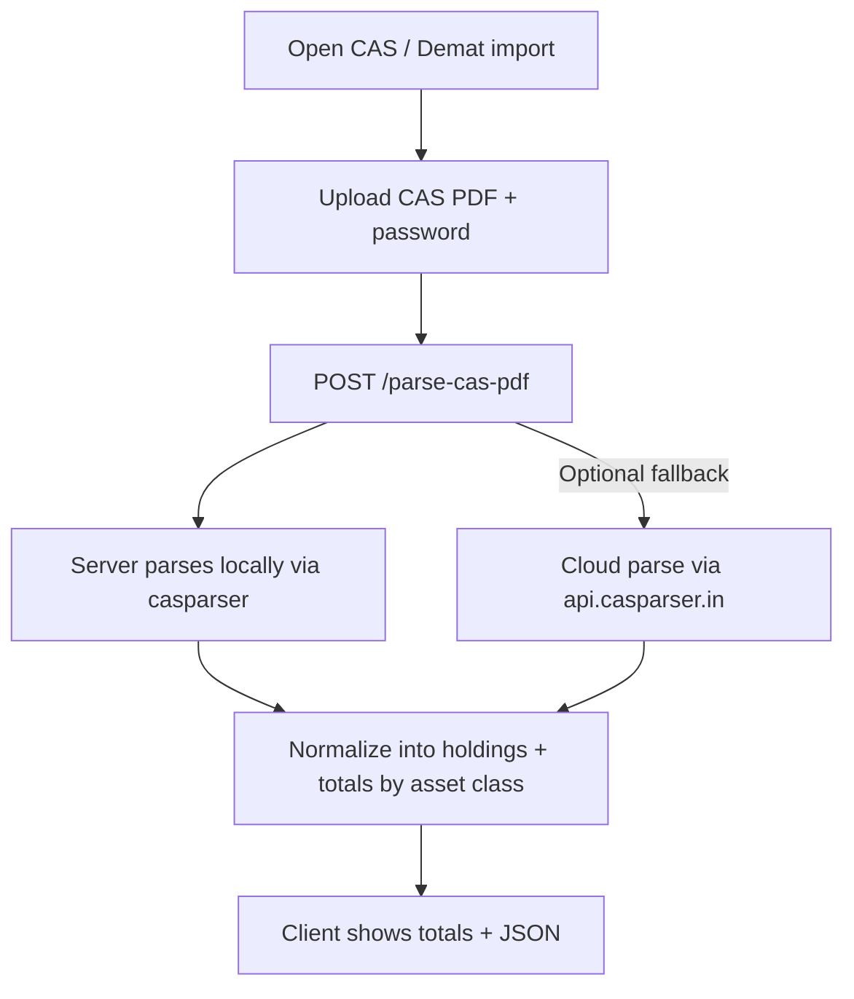

# Personal Wealth Analyzer

An AI-powered personal finance platform that analyzes spending, investment portfolios, and wealth allocation. It provides manual dashboards plus optional AI insights (requires `OPENAI_API_KEY`).

## Run the server (FastAPI)

- cd server
- python3 -m venv venv
- source venv/bin/activate
- `pip install -r requirements.txt` (the `-r` reads the file; without it pip looks for a package named "requirements")
- (If you use Anaconda, run `conda deactivate` first so the app uses the venv’s packages.)
- Run the app with the venv’s Python so the reloader uses it: **python -m uvicorn main:app --reload --host 0.0.0.0 --port 8000**
- Create `.env` inside `server`. Format:

```
OPENAI_API_KEY=YOUR_OPEN_AI_KEY
DEBUG=True
API_HOST=0.0.0.0
API_PORT=8000
```

Optional (CAS import cloud fallback):

```
CAS_PARSER_API_KEY=YOUR_CAS_PARSER_API_KEY
```

## Run the client (Expo / React Native Web)

- cd client
- npm run install
- npm run start

## Implemented dashboards (overview)

| Dashboard | What it does |
|-----------|--------------|
| **Account Statement Analyzer** | Upload bank PDF → tabulated data, spending charts, AI transaction insights. |
| **MF Analyzer** | Upload MF holdings Excel → allocation & concentration; **Manual** charts vs **AI** report + chat (AI report renders as readable sections when JSON is returned). |
| **Stock Market Analysis** | Upload equity holdings Excel → optional Yahoo-backed enrichment; **Manual** view vs **AI** report + chat. |
| **CAS / Demat import** | Upload India Consolidated Account Statement (CAMS/KFintech/CDSL eCAS/NSDL eCAS) PDF → server-side parsing into normalized holdings + totals by asset class. |
| **Wealth Distribution** | Enter **approx net worth**, optional **annual recurring income**, **upcoming expenses** (₹ Lakh) with **6- or 12-month** horizon, optional notes → **Manual** ideal split (₹ + %) for six segments from reference bands; **AI** suggests funding upcoming spends / boosting a bucket by shifting from other segments (with safety ordering). |
| **North Star Mode** | Enter income, expenses, assets, skills → **Compute** runs Wealth Engine, Simulation (A–F), Recommendations, Startup ideas, Knowledge Graph reasoning; **AI** narrative + Ask. Stock Analyzer adds **Copilot** tab (Buy/Hold/Exit signals). |

Flow diagrams also live in **`Flowchart.md`**. A compact set is included below for quick reference.

## Flowcharts (current)

### Shared app flow



### Account Statement Analyzer



### MF Analyzer



### Stock Market Analysis



### CAS / Demat import



### Wealth Distribution

```mermaid
flowchart TD
  A[Open Wealth Distribution] --> B[Enter NW + optional income + upcoming spend + horizon + notes]
  B --> C[Compute reference split (₹ ranges) from bands]
  C --> D[Manual alerts (short-term / emergency heuristics)]
  D --> E{Tab}
  E -->|Manual| F[Segments + midpoint chart]
  E -->|AI insights| G[POST /analyze-wealth-distribution-ai]
  E -->|Ask| H[POST /ask-wealth-distribution-ai]
```

## Design docs

| Doc | Description |
|-----|-------------|
| [`docs/north_star.md`](docs/north_star.md) | North Star Mode — Wealth Engine, Simulation Engine, path ranking |
| [`docs/investment_copilot.md`](docs/investment_copilot.md) | Investment Copilot — per-symbol signals (Buy/Hold/Exit), reasoning chains, APIs |
| [`docs/market_data_ingestion.md`](docs/market_data_ingestion.md) | Market data ingestion — NSE/BSE/NYSE/NASDAQ, ETL, caching, SQLite storage |

## Backlog / future features

- **North Star Mode**, **Investment Copilot** (see design docs above)
- **Budget Tracker**, **Goal Planner**, **Debt Manager**, **Cash Flow**, **Tax Optimizer**
- Cross-dashboard “home” summary, performance analytics, overlap analysis, India-first integrations (CAS-based imports expanded to more asset classes and actions)
